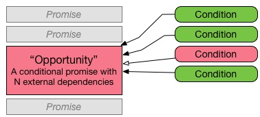
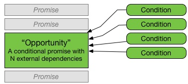
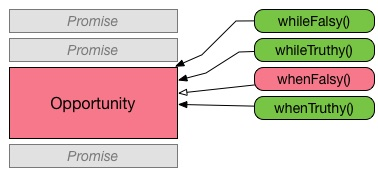

# Opportunity
> Action execution control via requirements and conditions - _Opportunities_

## About

**Opportunity** provides an asynchronous toolkit with which to manage promises and the actions they're ultimately responsible for executing. The **actions** and **conditions** provided by this library allow for the creation of complex asynchronous "stops", which are only triggered (allowing a promise chain or asynchronous procedure to continue) when all conditions for an action (opportunity) are validated (truthy).

Take a promise chain with a complex step that needs several dependencies to be in the correct state:



**Opportunity** provides a simple API for checking dependencies (functions, values etc.) to ensure they're all correct before continuing. Once they're all valid (at one point in time, as they're continuously checked), the action can execute:



Helper methods are provided to make checking states easier. Of course a condition can be controlled and triggered manually quite easily, but sometimes you need to check the result of an asynchronous function, and this is where the helper functions come in handy:



Let's look at a basic example:

```javascript
const { createAction, whenTruthy, whileFalsy } = require("opportunity");

function someTask() {
    return prefetchSomething()
        .then(createAction([
            whenTruthy(fetchValueFromAPI),
            whileFalsy(pageIsInactive)
        ]))
        .then(finalise);
}
```
